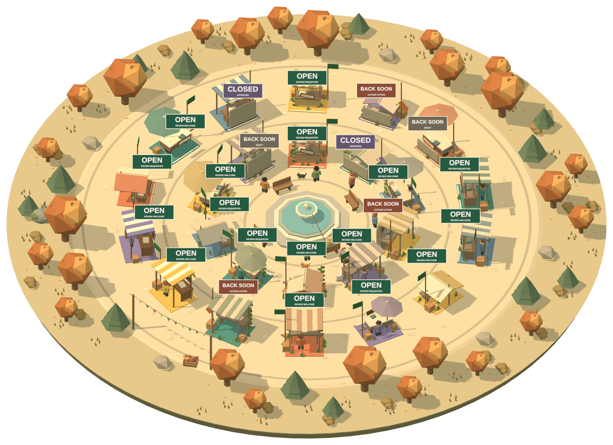

# Brocante

A marketplace for pull requests.

Brocante turns your GitHub repository’s open pull requests into a 3D flea market. Browse the shops,
spot aging PRs, and find your next review.

<p align="center">
  
</p>

## Quick start

Use Node.js 24 (minimum 22.12) and the pnpm version pinned in `package.json`.

```sh
pnpm install
pnpm dev
```

Open http://localhost:4321. The demo works without credentials. To connect GitHub, run
`pnpm setup:github` in bb or follow the [web setup guide](packages/web/README.md#connect-github).

## Packages

| Package                                   | Purpose                                                          |
| ----------------------------------------- | ---------------------------------------------------------------- |
| [Web](packages/web/README.md)             | Astro, React, and Three.js app deployed to Cloudflare Workers    |
| [Core](packages/core/README.md)           | Shared GitHub access, search, shop states, and report generation |
| [CLI](packages/cli/README.md)             | Local HTML, Markdown, and JSON reports                           |
| [bb plugin](packages/bb-plugin/README.md) | Pull-request reports in bb                                       |

The CLI bundles core for npm distribution. The private bb plugin bundles core for Git distribution;
the web and core packages are private.

## Development

Run these commands from the repository root:

```sh
pnpm validate        # Lint, formatting, type checks, unit tests, and all builds
pnpm --filter @brocante/web exec playwright install chromium
pnpm test:e2e        # Desktop and mobile browser tests
pnpm build:cli
pnpm build:plugin
```

`pnpm build:web` builds the web app; `pnpm deploy` builds and deploys it to Cloudflare.
See the package guides for [deployment](packages/web/README.md#deploy-to-cloudflare),
[CLI packaging](packages/cli/README.md#development), and
[plugin releases](packages/bb-plugin/README.md#git-releases).
